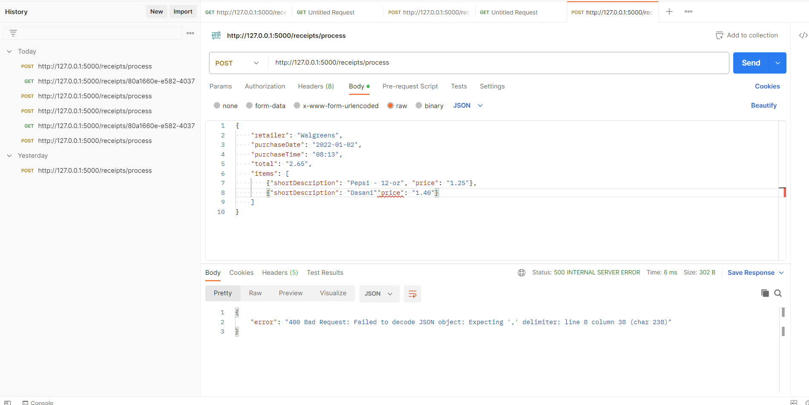

# Fetch_Assessment

# Receipt Processing Application

This is a Flask application that processes receipts and calculates points based on specific rules. The application provides endpoints to submit a receipt, retrieve the calculated points for a receipt, and view the documentation.

## Prerequisites

- Python 3.9 or higher
- Flask framework
- Postman (for sending HTTP requests)

## Setup and Execution

1. Clone the repository to your local machine: https://github.com/your-username/Fetch_Assessment.git
 
2. Navigate to the project directory: Fetch_Assessment
  
3. Install the required dependencies: pip install flask
 
4. Start the Flask application: python fetch.py

The Flask app will start running on `http://127.0.0.1:5000/`.

5. Use Postman to interact with the application:

- Send a POST request to `http://127.0.0.1:5000/receipts/process` to submit a receipt. In the request body, provide a JSON object representing the receipt. Example receipt JSON files, such as "morning-receipt.json" and "simple-receipt.json," are available in the "examples" directory.

- After submitting the receipt, you will receive a unique ID for that receipt.

  

- Send a GET request to `http://127.0.0.1:5000/receipts/{id}/points` (replace `{id}` with the actual receipt ID) to retrieve the points awarded for that receipt.

  

# Unit Test Cases

## Case 1

If the receipt json is not valid: The error message will be displayed as follows

  

## Case 2

If the receipt id is not valid: The error message will be displayed as follows

  

